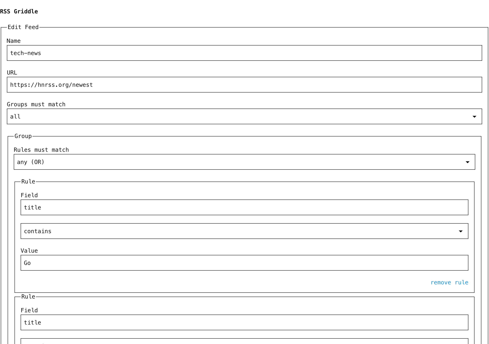

# Griddle

<p>
  
  
</p>

A tiny, self-hosted RSS filter proxy with a visual rule builder, multiple rules per feed, and nested logic groups.

**For self-hosters and developers** who pipe RSS into readers, automation tools, or scripts — and want to clean up noisy feeds before they get there.

[Live Demo](https://jamess-macbook-pro.tail3de3f9.ts.net)

## Features

- **Visual rule builder** — point-and-click filter creation, no YAML or config files
- **Unlimited rules with nested logic** — other tools give you one filter per feed. Griddle gives you as many as you need, organized into logic groups (AND/OR/NOR) with group-level logic on top — two levels of nesting.
- **Custom XML field support** — filter on any tag in the feed, not just title and description. If the feed has `<location>`, `<workmode>`, `<salary>`, or any other custom XML tag, you can build rules on it. Most RSS tools silently drop these fields — Griddle preserves and exposes them.
- **Tiny and focused** — ~650 lines of Go, no database, no framework — just a binary that filters feeds. Starts in milliseconds, runs on anything.
- **Pre-filter at the source** — filter once at the root, get clean signal everywhere downstream.
- **Mobile-friendly** — manage filters from your phone

## Quick Start

**Prerequisites:** [Go 1.21+](https://go.dev/dl/) or [Docker](https://docs.docker.com/get-docker/)

### Binary

```bash
git clone https://github.com/james-andrews-coulter/rss-griddle.git
cd rss-griddle
go build -o rss-griddle .
DATA_FILE=./feeds.json ./rss-griddle
```

Open http://localhost:4080.

### Docker

```bash
docker build -t rss-griddle .
docker run -p 4080:4080 -v rss-griddle-data:/data rss-griddle
```

### Docker Compose

Save as `docker-compose.yml`:

```yaml
services:
  rss-griddle:
    build: .
    ports:
      - "4080:4080"
    volumes:
      - ./data:/data
    restart: unless-stopped
```

## Usage

1. Open the web UI at `http://localhost:4080`
2. Create a feed: give it a name and paste the source RSS/Atom URL
3. Add rules: pick a field (`title`, `description`, `category`, or any custom XML tag), an operator (`contains`, `not contains`, `equals`, `not equals`), and a value
4. Organize rules into groups with AND/OR/NOR logic within each group
5. Add multiple groups with AND/OR/NOR logic between groups
6. Save — your filtered feed is available at `http://localhost:4080/feeds/<name>`

Drop that URL into any RSS reader, automation tool, or script. The feed is filtered live on every request.

## Configuration

| Variable | Default | Description |
|----------|---------|-------------|
| `DATA_FILE` | `/data/feeds.json` | Path to the JSON persistence file |
| `PORT` | `4080` | HTTP listen port |

Data is a single JSON file — no database required.

When running the binary directly (not Docker), set `DATA_FILE` to a writable path — the default `/data/feeds.json` assumes a Docker volume mount.

The `/health` endpoint returns `ok` — useful for Docker health checks and uptime monitoring.

## Architecture

Single-file Go app (`main.go`, ~650 lines) with no external framework:

```
Browser ──> Go HTTP server (:4080)
              ├── GET /              → UI: feed list + rule builder form
              ├── POST /feeds        → Create feed config
              ├── GET /feeds/{name}  → Filtered RSS XML output
              └── JSON file (/data/feeds.json)
```

**Filter engine:** Rules are compiled into [expr-lang](https://github.com/expr-lang/expr) expressions at request time. Each feed item is evaluated against the compiled expression — items that match pass through, the rest are dropped. The output is standard RSS 2.0 XML via [gorilla/feeds](https://github.com/gorilla/feeds).

**Feed parsing:** [gofeed](https://github.com/mmcdole/gofeed) parses upstream RSS/Atom feeds and — critically — preserves non-namespaced custom XML tags in `Item.Custom`. This is the technical foundation that makes custom field filtering possible; most RSS parsers silently discard these tags.

**Frontend:** Server-rendered Go templates with [HTMX](https://htmx.org) for dynamic form interactions and [terminal.css](https://terminalcss.xyz) for styling. No build step, no npm.

## FAQ

**Q: I get an error when saving a feed?**
The default `DATA_FILE` path is `/data/feeds.json`, which requires a `/data` directory. When running the binary directly, set `DATA_FILE=./feeds.json` (or any writable path) before starting the app.

**Q: What fields can I filter on?**
Standard RSS fields (`title`, `description`, `content`, `link`, `author`, `categories`/`category`) plus any custom XML tags in the feed items. If the feed has a `<location>` or `<salary>` tag, you can filter on it.

**Q: Is filtering case-sensitive?**
No. All comparisons are case-insensitive.

**Q: What happens if a field I'm filtering on doesn't exist in an item?**
It defaults to an empty string. A `contains` rule on a missing field won't match; a `not_contains` rule will.

**Q: Can I use this with [reader/tool]?**
If it reads RSS, yes. The filtered feed URL (`/feeds/<name>`) serves standard RSS 2.0 XML. Works with Miniflux, FreshRSS, Feedly, Inoreader, n8n, Zapier, or any tool that consumes RSS.

**Q: Why "Griddle"?**
A griddle is a miner's sieve — a nod to the data-miner-like level of control this tool gives you over your feeds.

## Alternatives

| Tool | What it does | Gap |
|------|-------------|-----|
| [rss-funnel](https://github.com/shouya/rss-funnel) | Modular RSS pipeline with YAML config | No visual UI, Rust parser drops custom XML tags |
| [feedfilter](https://github.com/cdzombak/feedfilter) | Go CLI with CEL expressions | CLI-only, single expression per feed, no UI |
| [rss-lambda](https://github.com/sekai-soft/rss-lambda) | Keyword include/exclude filtering | No saved rules, no logic groups, keyword-only |
| [FreshRSS](https://github.com/FreshRSS/FreshRSS) / [Miniflux](https://github.com/miniflux/v2) | Full RSS readers with built-in filters | Filtering is internal — no filtered feed URL output |

Griddle fills the gap: a visual rule builder with nested logic, custom XML field support, and filtered feed URL output — in a single self-hosted binary.

## Why I Built This

I built Griddle as part of a personal newspaper project — a daily email that pulls from RSS feeds, job boards, and local news. I needed to filter job feeds by custom XML fields like work mode and location, but every existing tool was either broken, SaaS-only, or couldn't read custom XML tags. It turned out Go's `gofeed` library was the only parser that preserves them, so I built a small filter proxy around it. I'm sharing it because the SaaS tools that used to do this (SiftRSS, FeedRinse, FeedSifter) are all gone, and self-hosters deserve a visual rule builder that works on real-world feeds.

## Credits

**Dependencies:**
- [gofeed](https://github.com/mmcdole/gofeed) — RSS/Atom parser that preserves custom XML tags
- [expr-lang](https://github.com/expr-lang/expr) — expression language for filter evaluation
- [gorilla/feeds](https://github.com/gorilla/feeds) — RSS 2.0 XML output
- [HTMX](https://htmx.org) — dynamic form interactions without JavaScript frameworks
- [terminal.css](https://terminalcss.xyz) — minimal terminal-style CSS

**Inspiration:**
- [rss-funnel](https://github.com/shouya/rss-funnel) — powerful RSS proxy, but YAML-only and drops custom XML tags
- [rverst/rss-filter](https://github.com/rverst/rss-filter) — Go RSS proxy with expression syntax, but no UI or persistence

---

Made with &hearts; by [James Coulter](https://www.jamesandrewscoulter.com) · [GitHub](https://github.com/james-andrews-coulter/rss-griddle) · [Buy me a coffee](https://buymeacoffee.com/jamesalexanderdesign)

## License

[MIT](LICENSE)
